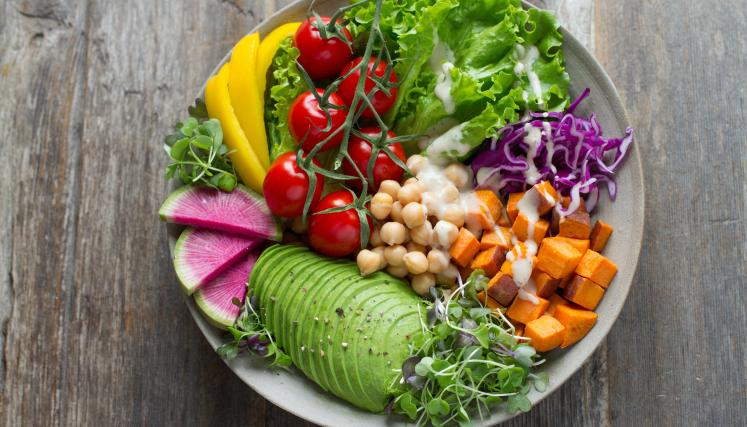
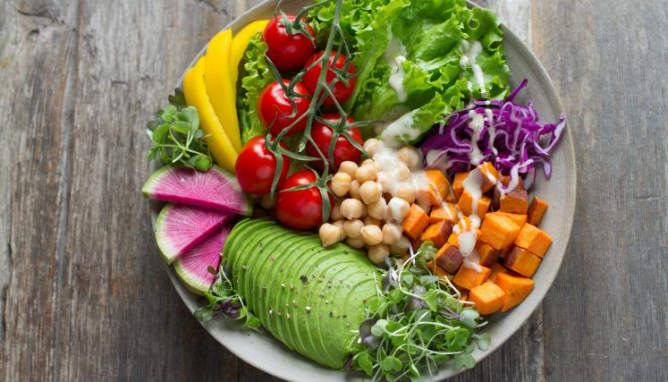

# Comida en tendencia

 La comida en tendencia es la que en la actualidad esta revolucionando el mundo de la cocina y reflejan un cambio en las preferencias del consumidor hacia opciones más saludables, sostenibles y variadas. algunas de estas tendencvias son:
 - Alimentos basados en plantas
 - Fermentados y probióticos
 - gastronomía molecular
 
mas info:https://www.seriouseats.com
# Alimentos basados en plantas
[[]

 La popularidad de las dietas veganas y vegetarianas sigue en aumento, y esto ha llevado a un auge en productos como hamburguesas de plantas, leches vegetales y alternativas a productos lácteos y cárnicos. algunas de las plantas que se utilizan en esta deta son:

- Legumbres
- Cereales y Granos
- Frutos secos y Semillas
- Vegetales
- Frutas
- Algas y Microalgas
- Tubérculos y Raíces
- Hongos

mas info:https://www.youtube.com/channel/UCq2E1mIwUKMWzCA4liA_XGQ
 

# Fermentados y probióticos

    Los fermentados y probióticos son alimentos y bebidas que han sido transformados por microorganismos beneficiosos como bacterias y levaduras. Estos procesos no solo preservan los alimentos, sino que también mejoran su sabor y valor nutricional. Los probióticos son microorganismos vivos que, cuando se consumen en cantidades adecuadas, ofrecen beneficios para la salud, especialmente para la salud digestiva.
Ejemplos comunes incluyen:

- Yogur: Leche fermentada con bacterias lácticas.
- Kéfir: Bebida fermentada similar al yogur pero más líquida, hecha con granos de kéfir.
- Kimchi y Chucrut: Col fermentada tradicional en la cocina coreana y alemana, respectivamente.
- Kombucha: Té fermentado con una colonia de bacterias y levaduras.
- Miso y Tempeh: Productos de soja fermentados utilizados en la cocina asiática. 

mas info:https://www.youtube.com/user/CulturedFoodLife/videos
# gastronomía molecular

 combina principios científicos con técnicas culinarias para crear experiencias gastronómicas innovadoras.
  La gastronomía molecular es una disciplina que aplica principios científicos para innovar en técnicas culinarias, creando experiencias gastronómicas únicas. Se centra en:

Nuevas técnicas de cocción: Como sous-vide y esferificación.
Ingredientes novedosos: Uso de hidrocoloides y nitrógeno líquido.
Transformación de texturas: Creación de geles, espumas y emulsiones.
Análisis sensorial: Mejora de la percepción del sabor y aroma.
Fermentación y conservación avanzada: Producción de sabores únicos y beneficios para la salud.

mas info:https://www.instagram.com/soycienciaycocina/?hl=es

recetas:https://minimalistbaker.com
